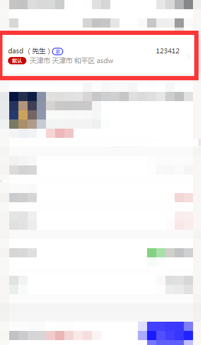
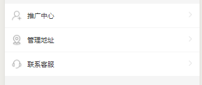
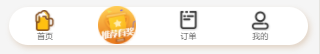

# 项目组件

|组件名称|作用|备注|
|------|-----|----|
|[addressItem](#一addressItem)|在订单或不同页面显示单条地址信息|NaN|
|[themeView](#二themeView)|在view中设置主题颜色|NaN|
|[infoItem](#三infoItem)|信息栏(含有图标)|NaN|
|[navBottom](#四navBottom)|定制化底部导航栏|NaN|

## 一、addressItem 
>说明：`addressItem`可以方便的在不同页面中展示当前地址信息。`addressItem`需要一个名为`addressInfo`的`props`以便展示地址信息。
### addressInfo的props
|键|值|类型|说明|
|-|-|-|-|
|addressInfo|{}|Object|单条地址信息对象|

### 键addressInfo的格式
```javascript
{
    id: 222,//addressId
    realname: "靳建奇",//名字
    mobile: "17724806779",//手机号
    province: "天津市",//省
    city: "天津市",//市
    area: "和平区",//区
    address: "金庸小区",//详细地址
    isdefault: "1",//0非默认1默认
    sex: "0",//0女1男
    type: "0"//0家1公司
}
```
### addressInfo组件的引入
```javascript
//引入页面order.json
{
  "usingComponents": {
    "address-item": "/components/addressItem/index"
  }
}
```

```html
//引入页面order.wxml
<address-item addressInfo='{{addressInfo}}'></address-item>
```

```html
//引入页面order.wxss
<address-item addressInfo='{{addressInfo}}'></address-item>
```

```javascript
//引入页面order.js
/** ....其他代码 */
  onShow: function() {
    //如果全局变量中有地址信息，则通过全局变量设置addressInfo
    if (app.globalData.currentAddress) {
      this.setData({
        addressInfo: app.globalData.currentAddress,
        ['orderInfo.address_id']: app.globalData.currentAddress.id
      })
      app.globalData.currentAddress = null;
    } else {
      //否则，通过api获取默认的addressInfo
      this.getDefaultAddress();//此函数中应当设置addressInfo
    }
  }
/** ....其他代码 */
```
### addressItem 样式截图


## 二、themeView
> `themeView`是一个可定制`border` `background` `color` 等与主题相关的替代`view`的组件，将`themeView`包裹包含主题颜色的组件，将可以进行对内容进行主题颜色等更改。具体方法请参照下列实例。
### themeView的props
|键|默认值|类型|说明|
|-|-|-|-|
|globalFlag|false|Boolean|是否从全局变量中读取属性值|
|storageFlag|false|Boolean|是否从storage中读取属性值|
|type|""|String|[CSS属性名](#在全局或storage中配置type名称)|

**themeView需要从全局变量或storage读取css属性***请按照规则对相应的全局变量或storage进行配置*
### themeView组件的使用方式
- `json中进行引入`
- `wxml中引入`
```html
<theme-view class='btn2' type="themeBack">
  <view bindtap='navToOrderDetail'>查看订单</view>
</theme-view>
```
`themeView`需要接受`type`,`type`是在`globalData`或`storage`中配置的`CSS`,请确保有对应的`CSS`内容。

### 在全局或storage中配置type(CSS)
```javascript
//app.js
/** 其他代码 */
globalData: {
  themeBack: 'margin:0!important;background:#0000ff!important;color:#fff!important;border-radius:400px;', //themeBack风格
}
/** 其他代码 */
```
### 作用
>可以将经常需要变动的CSS部分放在js中进行处理，动态的通过`api`而不需要修改代码的进行颜色，字体等的修改。
## 三、infoItem
>说明：在`我的` `推广中心` `设置`等很对页面里，有很多的`信息栏`(左面小图标，中间标题，右面小箭头且一般点击可以跳转到新的页面)，实际上可以说是对`navigator`的封装，但是组件中并没有包含`navigator`，需要自己使用`navigator`在包一层。
### infoItem的props
|键|默认值|类型|说明|
|-|-|-|-|
|info|{}|Object|传入的info信息|

### 键info的格式
```javascript
{
  iconImg: '/res/icon/icon-extension.png',
  title: '推广中心',
  iconArr: '/res/icon/icon_right_click.png',
  url: '/pages/user/referCenter/referCenter',
  showFlag: false
}
```
### 使用实例
```html
<!--引入页面user.html-->
<info-item bindtap='callPhone' info="{{kefuInfo}}"></info-item>
```
### 样式

## 四、navBottom
>说明：微信小程序提供的原生`tabbar`样式不是很好看，很难实现许多特性。固根据特定项目对`tabbar`进行了封装`navBottom`以便替换原生的`tabbar`。
### navBottom 的props
|键|默认值|类型|说明|
|-|-|-|-|
|selectedIndex|0|Number|当前页面|
|navBtnList|[]|Object|图标样式信息|

### 键navBtnList的格式
```javascript
[
  {
    url: '/pages/home/home',
    img: '/res/icon/nav-icon-home.png',
    selectedImg: '/res/icon/nav-icon-home-pre.png',
    title: '首页',
    havT: true
  }, 
  {
    url: '/pages/recommend/recommend',
    img: '/res/icon/tuijian.png',
    selectedImg: '/res/icon/tuijian.png',
    title: '推荐有奖',
    havT: false
  },{

    url: '/pages/order/order',
    img: '/res/icon/nav-icon-order.png',
    selectedImg: '/res/icon/nav-icon-order-pre.png',
    title: '订单',
    havT: true
  },{

    url: '/pages/user/user',
    img: '/res/icon/nav-icon-user.png',
    selectedImg: '/res/icon/nav-icon-user-pre.png',
    title: '我的',
    havT: true
  }
]
```

### 引入方式
```html
<!--引入的home.html-->
<nav-bottom selected-index='0' navBtnList='{{navBtnList}}'></nav-bottom>
```

### 样式

